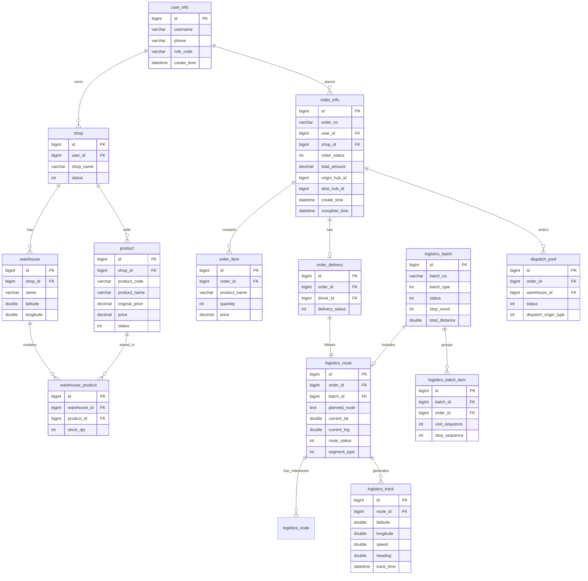
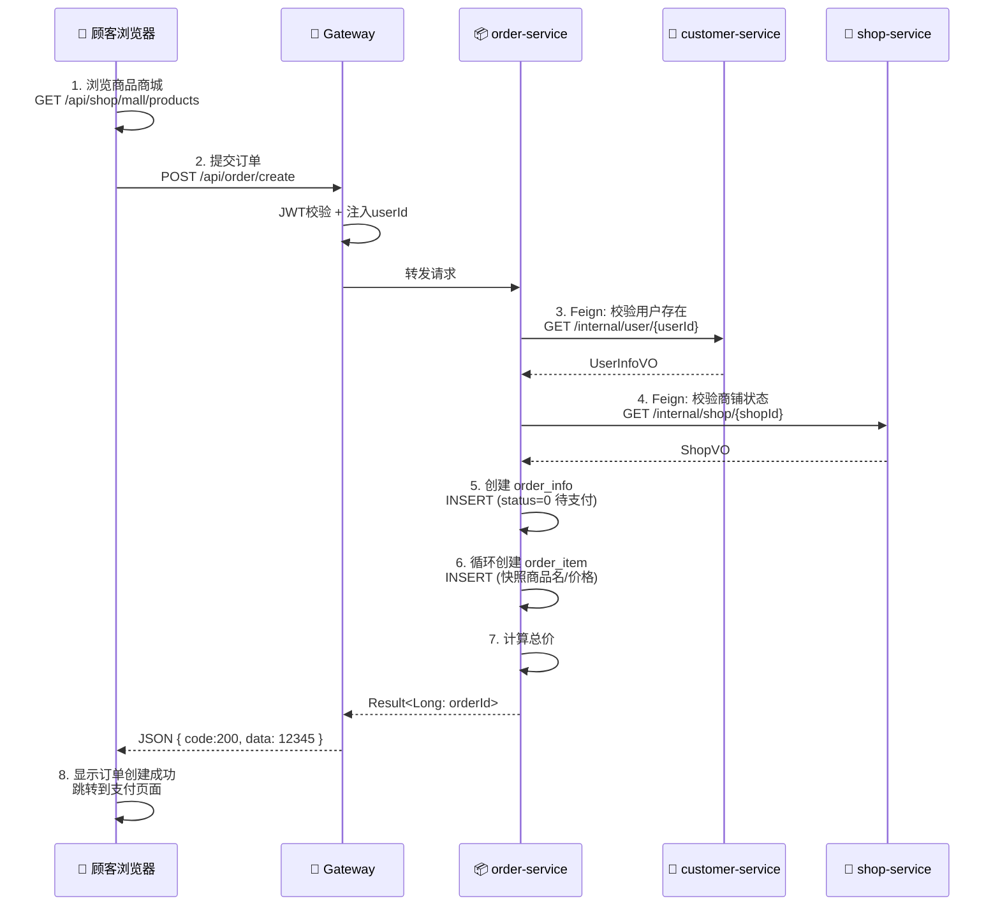
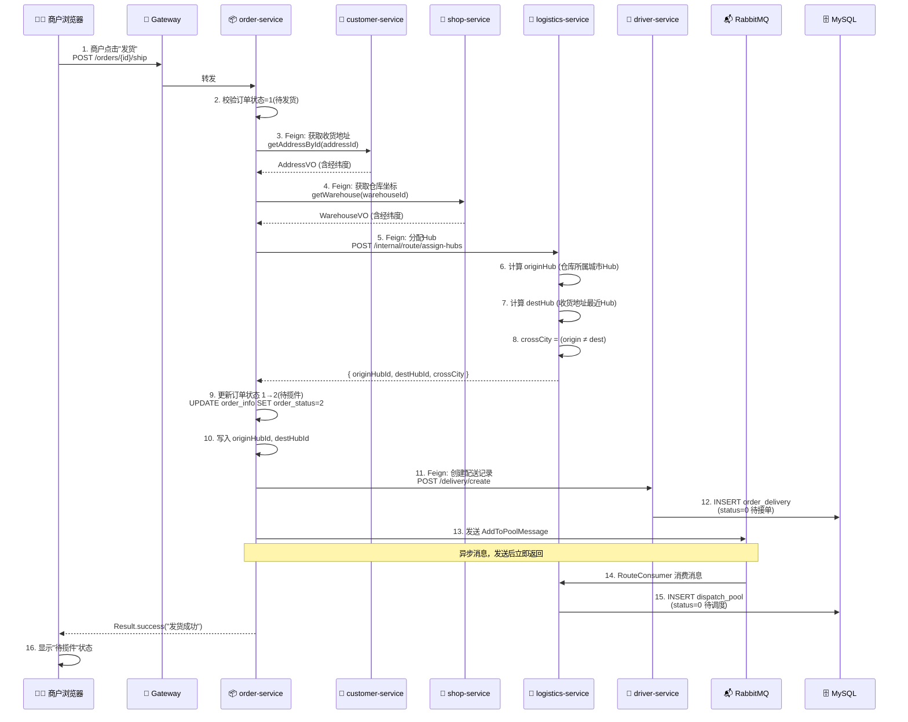
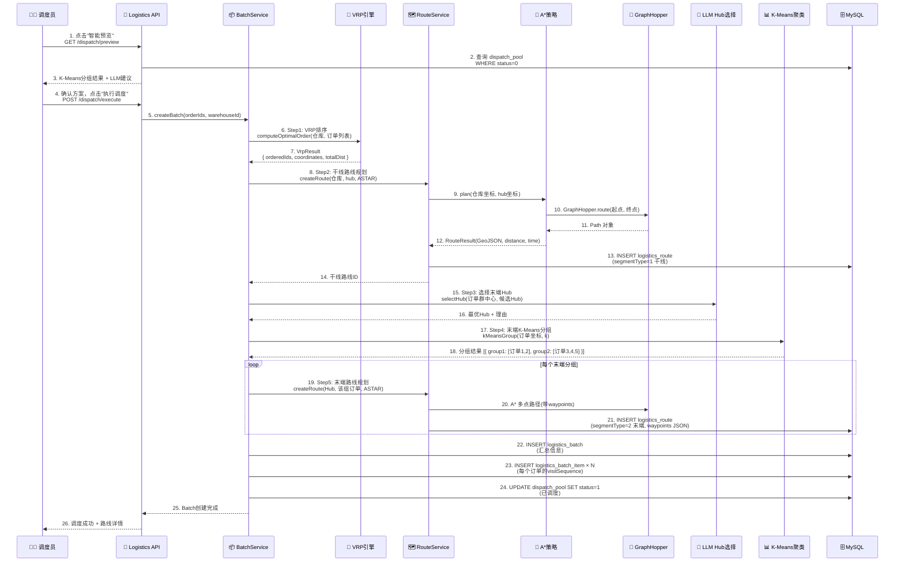
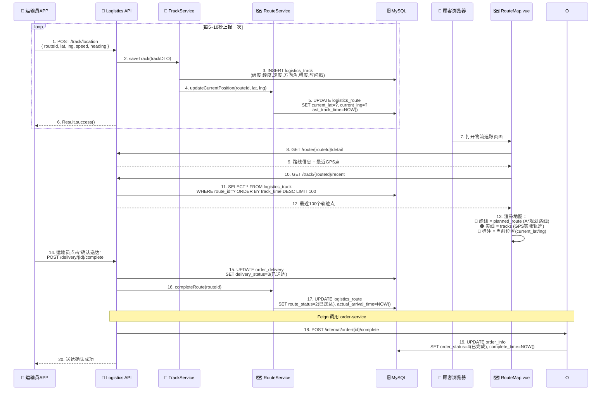
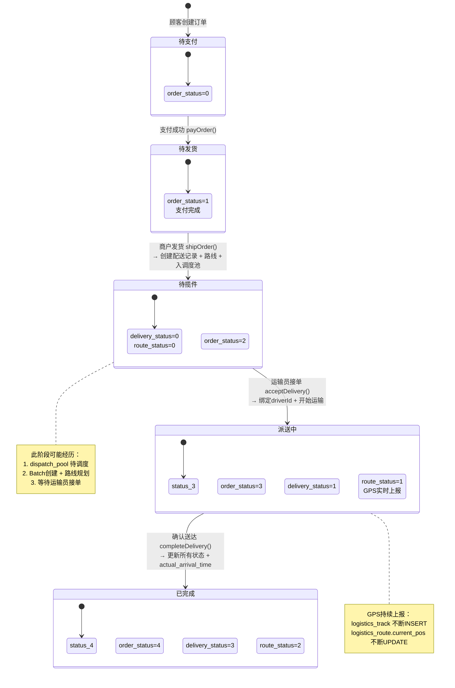

# Transportation 物流系统 —— 7天从零到精通学习指南

> **目标读者**：零前后端基础的计算机爱好者  
> **项目地址**：`https://github.com/AlexLuser/Transportation`  
> **本地路径**：`/Users/miao/IdeaProjects/Transportation/`  
> **当前工作区**：`/Users/miao/CodeBuddy/Transportation/`  
> **预计耗时**：每天 4~6 小时，共 7 天

---

## 目录

- [第一部分：核心概念清单](#第一部分核心概念清单)
  - [一、后端核心概念（Spring Boot + 微服务）](#一后端核心概念spring-boot--微服务)
  - [二、前端核心概念（Vue 3 + TypeScript）](#二前端核心概念vue-3--typescript)
  - [三、数据库与中间件](#三数据库与中间件)
  - [四、本项目特有概念](#四本项目特有概念)
- [第二部分：7天渐进式学习计划](#第二部分7天渐进式学习计划)
  - [Day 1：编程启蒙 —— Java 基础与开发环境](#day-1编程启蒙--java-基础与开发环境)
  - [Day 2：后端基石 —— Spring Boot 四层架构](#day-2后端基石--spring-boot-四层架构)
  - [Day 3：微服务生态 —— 服务拆分与通信](#day-3微服务生态--服务拆分与通信)
  - [Day 4：前端入门 —— Vue 3 组件化开发](#day-4前端入门--vue-3-组件化开发)
  - [Day 5：数据层 —— 数据库设计与 ORM](#day-5数据层--数据库设计与-orm)
  - [Day 6：核心业务 —— 物流算法与统筹逻辑](#day-6核心业务--物流算法与统筹逻辑)
  - [Day 7：全栈贯通 —— 端到端流程追踪实战](#day-7全栈贯通--端到端流程追踪实战)
- [第三部分：项目架构图](#第三部分项目架构图)
- [第四部分：核心业务流程图](#第四部分核心业务流程图)

---

## 第一部分：核心概念清单

> **学习策略**：不需要一次性全部背下来。每个概念会在对应那天深入学习时自然理解。
> 这份清单的作用是让你建立**心理地图**——知道前方有哪些山头要翻越。

---

### 一、后端核心概念（Spring Boot + 微服务）

#### 1.1 Java 语言基础

| 概念 | 一句话解释 | 类比 |
|------|-----------|------|
| **类 (Class)** | 代码的蓝图/模板，定义对象的属性和行为 | 房屋设计图 |
| **对象 (Object)** | 类的实例，实际运行时存在的实体 | 按设计图盖出来的具体房子 |
| **方法 (Method)** | 对象能执行的操作/函数 | 房子的"开门"、"开灯"功能 |
| **属性/字段 (Field)** | 对象持有的数据 | 房子的面积、楼层 |
| **接口 (Interface)** | 只声明方法不写实现，规定"必须做什么" | 合同/协议——只写条款不负责执行 |
| **实现类 (Implementation)** | 接口的具体落地代码 | 按合同干活的人 |
| **注解 (Annotation)** | 以 `@` 开头的特殊标记，给代码加"标签" | 给文件贴上"机密""加急"标签，系统根据标签做不同处理 |
| **泛型 `<T>`** | 类型参数化，让一个方法适用于多种数据类型 | 通用充电器——不管什么手机都能用 |
| **依赖注入 (DI)** | 不自己创建对象，由框架自动提供 | 不用自己做菜，餐厅直接把菜端上来 |
| **Maven** | 项目构建工具，管理依赖库（类似 npm） | 超市采购员——你列好清单，它帮你把东西买回来 |

**本项目中最常出现的 Java 关键字速查：**

```java
public      // 公开的，谁都能访问
private     // 私有的，只有当前类内部能用
class       // 定义类
interface   // 定义接口
implements  // 实现接口（"我承诺履行合同"）
extends     // 继承父类（"我是某人的子类"）
return      // 返回结果
void        // 无返回值
static      // 静态的，属于类不属于对象
final       // 最终的，不可修改
new         // 创建新对象
this        // 指代当前对象自身
```

#### 1.2 Spring Boot 核心

| 概念 | 一句话解释 | 本项目中的位置 |
|------|-----------|--------------|
| **`@RestController`** | 标记此类为 API 控制器，处理 HTTP 请求 | 每个 `*Controller.java` 文件头部 |
| **`@Service`** | 标记此类为业务逻辑层 | 每个 `*ServiceImpl.java` 文件头部 |
| **`@Autowired` / `@Resource`** | 自动注入依赖——让框架把需要的对象自动送过来 | Service 中调用 Mapper 或其他 Service 时 |
| **`@Configuration`** | 标记配置类 | `RoutingStrategyConfig.java` 等 |
| **`@Bean`** | 将方法的返回值注册为可复用的组件 | 策略模式工厂中创建 Strategy 实例 |
| **`@Primary`** | 当有多个同类型 Bean 时，标记默认使用哪个 | `AStarRouteStrategy` 上标记了 `@Primary` |
| **application.yml** | 配置文件，放端口、数据库连接等设置 | 每个 service 目录下都有一个 |
| **`Result<T>`** | 统一的 API 返回格式包装类 | `common` 模块中，所有接口都用它返回 |

**Spring Boot 的"魔法"过程（初学必读）：**

```
浏览器发送 HTTP GET /api/logistics/route/123
    ↓
① Tomcat（内置服务器）接收请求
    ↓
② DispatcherServlet（中央调度器）找到对应的 @RestController
    ↓
③ 根据 @GetMapping("/route/{id}") 匹配到 RouteController.getRouteById()
    ↓
④ Spring 自动把 URL 中的 123 注入方法参数 Long id
    ↓
⑤ 方法内部调用 @Autowired 注入的 routeService.getById(id)
    ↓
⑥ routeService 内部调用 routeMapper.selectById(id) → 执行 SQL
    ↓
⑦ SQL 结果映射成 RouteEntity → 转成 RouteVO → 包装进 Result<RouteVO>
    ↓
⑧ Spring MVC 自动将 Result 对象序列化为 JSON 字符串
    ↓
⑨ JSON 通过 HTTP 响应返回给前端
```

**这就是一次完整请求的全生命周期。Day 2 会逐行追踪。**

#### 1.3 微服务架构概念

| 概念 | 一句话解释 | 本项目中的角色 |
|------|-----------|--------------|
| **微服务 (Microservice)** | 把一个大应用拆成多个小服务，各自独立运行 | 8 个独立 service，每个有自己的端口 |
| **API 网关 (Gateway)** | 所有请求的统一入口，负责路由转发+认证 | `gateway-service:8083` |
| **服务注册发现 (Nacos)** | 各服务启动时向 Nacos "报到"，互相通过名字查找对方 | Nacos Server 记录所有服务的 IP 和端口 |
| **Feign 客户端** | 声明式 HTTP 客户端——像调本地方法一样调用其他服务 | order-service 调 shop-service 扣库存 |
| **负载均衡 (LoadBalancer)** | 当一个服务有多台机器时，均匀分配请求 | 默认轮询策略 |
| **配置中心** | 集中管理所有服务的配置，改一处全局生效 | Nacos Config |

**网关的拦截流程（每次请求都会经过）：**

```
前端请求: GET http://localhost:8083/api/order/123
                              ↓
                    ┌─────────────────┐
                    │  Gateway 网关    │
                    │  :8083          │
                    ├─────────────────┤
                    │ ① 过滤路由规则   │
                    │  /api/order/**  │
                    │  → order-service│
                    │                 │
                    │ ② JWT Token校验 │
                    │  解析userId/role │
                    │  注入请求头      │
                    │                 │
                    │ ③ 转发请求       │
                    │  → :8086        │
                    └────────┬────────┘
                             ↓
              order-service 收到请求（已带 userId）
```

#### 1.4 数据访问层

| 概念 | 一句话解释 | 本项目中 |
|------|-----------|---------|
| **MyBatis-Plus** | ORM 框架，Java 对象 ↔ 数据库表自动映射 | 所有 `*Mapper.java` 都继承 `BaseMapper<T>` |
| **Entity** | 与数据库表一一对应的 Java 类 | `LogisticsRouteEntity` ↔ `logistics_route` 表 |
| **Mapper 接口** | 定义数据库操作方法（CRUD） | `LogisticsRouteMapper extends BaseMapper<LogisticsRouteEntity>` |
| **`@TableName`** | 标注 Entity 对应哪张表 | Entity 类名上 |
| **`@TableId`** | 标注主键字段 | `id` 字段上 |
| **`@Mapper`** | 标识这是 MyBatis 的 Mapper 接口 | Mapper 接口上 |
| **XML Mapper 文件** | 放复杂 SQL 的 XML 文件 | `resources/mapper/*.xml` |

**MyBatis-Plus 的常用操作速查：**

```java
// 基础 CRUD（BaseMapper 自带，不用手写 SQL）
mapper.selectById(123L);                    // 按 ID 查一条
mapper.selectList(null);                    // 查全部
mapper.insert(entity);                      // 插入
mapper.updateById(entity);                  // 按 ID 更新
mapper.deleteById(123L);                    // 按 ID 删除

// 条件构造器（动态拼接 WHERE 条件）
mapper.selectList(
    new LambdaQueryWrapper<LogisticsRouteEntity>()
        .eq(LogisticsRouteEntity::getOrderId, orderId)  // WHERE order_id = ?
        .ne(LogisticsRouteEntity::getRouteStatus, -1)    // AND route_status != -1
        .orderByDesc(LogisticsRouteEntity::getCreateTime)// ORDER BY create_time DESC
);
```

#### 1.5 服务间通信与消息

| 概念 | 一句话解释 | 用途 |
|------|-----------|------|
| **Feign 调用** | 同步 HTTP 调用，等待返回结果 | 发货时同步扣库存、查询地址 |
| **RabbitMQ / 消息队列** | 异步消息传递，发送后不等结果 | 发货后异步写入 dispatch_pool |
| **生产者 (Producer)** | 消息发送方 | order-service 发送 AddToPoolMessage |
| **消费者 (Consumer)** | 消息接收处理方 | logistics-service 的 RouteConsumer |
| **消息可靠性** | 确保消息不丢失的机制 | 手动 ACK、持久化队列 |

---

### 二、前端核心概念（Vue 3 + TypeScript）

#### 2.1 JavaScript/TypeScript 基础

| 概念 | 一句话解释 | 示例 |
|------|-----------|------|
| **变量 (`let`/`const`)** | 存储数据的容器 | `const name = "物流系统"` |
| **函数 (`function`/箭头函数 `=>`)** | 封装可复用的操作 | `const add = (a, b) => a + b` |
| **对象 `{}`** | 键值对集合 | `{ name: "张三", age: 25 }` |
| **数组 `[]`** | 有序列表 | `[1, 2, 3]` |
| **async/await** | 异步编程语法，让异步代码看起来同步 | `const data = await api.getOrder()` |
| **Promise** | 异步操作的结果容器（await 的底层机制） | `fetch(url).then(res => res.json())` |
| **解构赋值** | 从对象/数组中提取值 | `const { id, name } = user` |
| **模板字符串** | 可嵌入变量的字符串 | `` `订单号: ${orderId}` `` |
| **TypeScript 类型** | 给变量加类型约束，编译时检查错误 | `let id: number = 123` |
| **接口 `interface`** | 定义对象的结构/形状 | `interface Order { id: number; status: string }` |
| **`?.` 可选链** | 安全访问可能为 null 的属性 | `user?.address?.city` |
| **`??` 空值合并** | 左侧为 null/undefined 时使用右侧值 | `name ?? "匿名"` |

#### 2.2 Vue 3 核心概念

| 概念 | 一句话解释 | 本项目中 |
|------|-----------|---------|
| **组件 (Component)** | 可复用的 UI 单元，`.vue` 文件 | 每个 `.vue` 文件就是一个组件 |
| **模板 (`<template>`)** | 组件的 HTML 结构 | 写页面布局的地方 |
| **脚本 (`<script setup lang="ts">`)** | 组件的逻辑代码 | 写数据处理和交互的地方 |
| **样式 (`<style>`)** | 组件的 CSS 样式 | 写外观的地方 |
| **响应式数据 (`ref`/`reactive`)** | 数据变化时自动更新 UI | `const count = ref(0)` — 改 count 页面自动刷新 |
| **计算属性 (`computed`)** | 根据其他数据自动计算的值 | `const double = computed(() => count.value * 2)` |
| **`onMounted()`** | 组件加载完成时执行的钩子（=页面打开时） | 通常在这里发 API 请求加载数据 |
| **`v-for`** | 循环渲染列表 | `<div v-for="order in orders">{{ order.id }}</div>` |
| **`v-if`/`v-show`** | 条件显示/隐藏 | `<div v-if="isLoading">加载中...</div>` |
| **`v-model`** | 双向绑定——输入框和数据同步 | `<input v-model="searchText" />` |
| **`@click`** | 点击事件 | `<button @click="handleSubmit">提交</button>` |
| **Props** | 父组件传给子组件的数据 | `<RouteMap :routeId="123" />` |
| **Emits (`emit`)** | 子组件通知父组件的事件 | `emit('update', newValue)` |
| **组合式函数 (Composable)** | 复用逻辑的函数，以 `use` 开头 | `useRouteStore.ts`、`useAuth.ts` |

**一个典型 Vue 3 组件的结构解剖：**

```vue
<!-- OrderList.vue — 订单列表组件 -->
<script setup lang="ts">
// ========== 1. 导入 ==========
import { ref, onMounted } from 'vue'       // Vue 核心
import { getOrderList } from '@/api/order' // API 请求函数
import type { OrderItem } from '@/types'   // 类型定义

// ========== 2. 响应式状态 ==========
const orders = ref<OrderItem[]>([])        // 订单列表数据
const loading = ref(false)                  // 加载状态
const currentPage = ref(1)                  // 当前页码

// ========== 3. 方法定义 ==========
const fetchData = async () => {
  loading.value = true
  try {
    const res = await getOrderList({ page: currentPage.value })  // 发请求
    orders.value = res.data              // 赋值 → 触发视图更新
  } finally {
    loading.value = false
  }
}

// ========== 4. 生命周期钩子 ==========
onMounted(() => {
  fetchData()                            // 页面加载时自动请求数据
})
</script>

<template>
  <!-- 5. 模板：HTML结构 + 数据绑定 -->
  <div class="order-list">
    <div v-if="loading">加载中...</div>
    <table v-else>
      <tr v-for="order in orders" :key="order.id">
        <td>{{ order.orderNo }}</td>
        <td>{{ formatStatus(order.status) }}</td>
        <td><button @click="handleDetail(order)">查看</button></td>
      </tr>
    </table>
  </div>
</template>

<style scoped>
/* 6. 样式：仅作用于本组件 */
.order-list { padding: 20px; }
table { width: 100%; border-collapse: collapse; }
</style>
```

#### 2.3 前端工程化与工具链

| 概念 | 一句话解释 | 本项目 |
|------|-----------|--------|
| **Vite** | 前端构建工具，比 Webpack 快很多 | `frontend/vite.config.ts` |
| **npm/pnpm** | 包管理器，下载第三方库 | `frontend/package.json` 定义依赖 |
| **TypeScript 编译器** | 将 .ts 编译为 .js 让浏览器运行 | `.ts` 文件自动编译 |
| **Element Plus** | 基于 Vue 3 的 UI 组件库（按钮/表格/弹窗等） | `ElButton`、`ElTable`、`ElDialog`... |
| **Vue Router** | 前端路由——URL 变化切换页面内容 | `router/index.ts` 定义所有路由规则 |
| **Pinia** | 状态管理——跨组件共享数据 | stores/user.ts 存登录信息 |
| **Axios** | HTTP 客户端，发请求给后端 | `utils/request.ts` 封装的 axios 实例 |
| **SCSS** | CSS 的超集，支持变量/嵌套 | `.vue` 文件的 `<style lang="scss">` |

**前端目录结构速认：**

```
frontend/
├── src/
│   ├── api/          ← 后端接口定义（每个后端Controller对应一个ts文件）
│   ├── assets/       ← 静态资源（图片/字体）
│   ├── components/   ← 通用可复用组件
│   ├── composables/  ← 组合式函数（复用逻辑）
│   ├── layouts/      ← 页面布局骨架（侧边栏/顶栏）
│   ├── router/       ← 路由配置
│   ├── stores/       ← Pinia 状态仓库
│   ├── types/        ← TypeScript 类型定义
│   ├── utils/        ← 工具函数（请求封装/格式化等）
│   ├── views/        ← 页面组件（每个URL对应一个.vue文件）
│   ├── App.vue       ← 根组件
│   └── main.ts       ← 入口文件
├── package.json      ← 依赖清单
└── vite.config.ts    ← Vite 构建配置
```

---

### 三、数据库与中间件

#### 3.1 MySQL 关系型数据库

| 概念 | 一句话解释 |
|------|-----------|
| **数据库 (Database)** | 数据的容器，本项目有多个库/表 |
| **表 (Table)** | 二维数据结构，行列形式存储同类数据 |
| **主键 (Primary Key)** | 唯一标识一行数据的字段（通常是自增ID） |
| **外键 (Foreign Key)** | 引用另一张表主键的字段，建立表间关联 |
| **索引 (Index)** | 加速查询的数据结构（类似书的目录） |
| **事务 (Transaction)** | 一组 SQL 要么全部成功要么全部回滚 |
| **JOIN** | 跨表关联查询 |
| **聚合函数** | COUNT/SUM/AVG/MAX/MIN |

**本项目核心数据表总览：**

| 表名 | 所属服务 | 行数 | 核心字段 | 职责 |
|------|---------|------|---------|------|
| `order_info` | order | 2张 | id, order_no, user_id, order_status, total_amount | 主订单表 |
| `order_item` | order | - | id, order_id, product_name, quantity, price | 订单商品快照 |
| `order_delivery` | logistics | - | id, order_id, driver_id, delivery_status | 配送记录 |
| `logistics_route` | logistics | 6张 | id, order_id/batch_id, planned_route(GeoJSON), route_status | 路线规划结果 |
| `logistics_track` | logistics | - | id, route_id, latitude, longitude, speed, track_time | GPS轨迹点 |
| `dispatch_pool` | logistics | - | id, order_id, warehouse_id, status | 待调度订单池 |
| `product` | shop | 5张 | id, shop_id, product_code, price, status | 商品表 |
| `warehouse_product` | shop | - | id, warehouse_id, product_id, stock_qty | 仓库-商品库存（N:M中间表） |
| `warehouse` | shop | - | id, shop_id, name, latitude, longitude | 仓库表 |
| `user_info` | customer/user | - | id, username, phone, role_code | 用户表 |

#### 3.2 Redis 缓存

| 概念 | 一句话解释 | 本项目用途 |
|------|-----------|----------|
| **Key-Value 存储** | 内存数据库，读写极快（比MySQL快100倍以上） | 缓存Token/Session/热数据 |
| **String 类型** | 简单键值对 | 存储 JWT Token 黑名单 |
| **Hash 类型** | 对象形式的键值 | 用户会话信息 |
| **过期时间 (TTL)** | key 自动删除时间 | Token 过期控制 |

#### 3.3 Nacos 注册中心 & 配置中心

| 功能 | 解释 |
|------|------|
| **服务注册** | 每个service启动时把自己的IP:端口告诉Nacos |
| **服务发现** | 需要调用别人时，从Nacos查对方的地址 |
| **配置管理** | `bootstrap.yml` 连接Nacos后，从Nacos拉取配置 |
| **配置热更新** | 在Nacos控制台改配置，服务无需重启立即生效 |

---

### 四、本项目特有概念

#### 4.1 物流领域术语

| 术语 | 含义 | 本项目体现 |
|------|------|-----------|
| **Last Mile（末端配送）** | Hub/仓库 → 最终收货人的最后一段路 | `segmentType=2` 的路线 |
| **Line Haul（干线运输）** | 城市/Hub之间的长途运输 | `segmentType=1` + MCMF规划的路线 |
| **Hub-and-Spoke** | 轮辐模式——货物先汇集到中心枢纽再分发 | LlmHubSelection 选择最优中转站 |
| **VRP (Vehicle Routing Problem)** | 车辆路径问题——多停靠点顺序优化 | NearestNeighborVrpStrategy |
| **MCMF (Min-Cost Max-Flow)** | 最小费用最大流——网络流量分配优化 | McmfServiceImpl 全国干线流量分配 |
| **GeoJSON** | 地理信息的 JSON 格式标准 | `planned_route` 字段存的是 LineString 类型 GeoJSON |
| **Waypoint（路点）** | 路径上的途经点 | VRP输出的有序停靠点序列 |
| **Dispatch Pool（调度池）** | 待调度订单的集合区域 | dispatch_pool 表 |

#### 4.2 算法概念

| 算法 | 一句话解释 | 直觉理解 |
|------|-----------|---------|
| **A\*** | 带启发式的最短路径搜索 | GPS导航的核心算法——"往目标方向走 + 已走距离"综合判断 |
| **Haversine 公式** | 地球表面两点间的球面距离 | 精确的"直线距离"（考虑地球曲率） |
| **K-Means** | 将数据分成 K 个簇的聚类算法 | 把地图上的订单点自动分组 |
| **最近邻启发式 (Nearest Neighbor)** | 每次选最近的下一个点 | 快递员送件的最朴素策略——"先送最近的" |
| **最小费用最大流 (MCMF)** | 图论算法，在流量最大的前提下费用最小 | 全国快递分拨中心之间如何分配包裹量 |
| **SPFA** | MCMF 中找最短路增广路的子算法 | 类似 Dijkstra 但能处理负权边 |

#### 4.3 设计模式

| 模式 | 在哪里用 | 怎么用的 |
|------|---------|---------|
| **策略模式 (Strategy)** | RouteService 的路线规划 | `RouteStrategy` 接口 → A*/LLM_JUDGE/LLM_WAYPOINT 三个实现，通过配置切换 |
| **工厂模式 (Factory)** | `RoutingStrategyConfig` | 根据配置字符串决定创建哪个 Strategy 实例 |
| **模板方法 (Template Method)** | `LogisticsBatchServiceImpl.createBatch()` | 固定流程骨架（VRP→干线→末端），步骤内可变 |
| **观察者/发布订阅** | RabbitMQ MQ 消息 | 发货事件 → 多个消费者独立反应（写调度池、通知司机等） |
| **DTO 模式** | 全局 | Data Transfer Object——不同层之间传数据用不同的对象，避免 Entity 直接暴露 |

---

## 第二部分：7天渐进式学习计划

> **每日结构**：理论学习(30%) → 代码阅读(40%) → 动手验证(30%)
> 
> **前置准备**：安装 IntelliJ IDEA Community Edition（免费）、安装 VS Code 插件（可选）、确保 JDK 17+ 和 Node.js 18+ 已安装

---

### Day 1：编程启蒙 —— Java 基础与开发环境

**今日目标**：能读懂 Java 类的基本结构，搭建好能运行项目的环境。

#### 📚 理论学习（2小时）

**上午：Java 语法极速入门（只学本项目会用到的）**

1. **包 (package) 与导入 (import)**
   ```java
   package com.transport.logistics.service;  // 当前类的归属"部门"
   import com.transport.common.Result;        // 引用其他"部门的"类
   ```
   *类比：公司的部门编号和跨部门协作申请*

2. **类的基本结构**
   ```java
   public class OrderService {           // 类名：首字母大写驼峰
       private OrderMapper mapper;       // 属性：私有的依赖对象
       
       public Result<OrderVO> getById(Long id) {  // 方法：公开的，返回Result包装
           OrderEntity entity = mapper.selectById(id);  // 调用Mapper查数据库
           return Result.success(convertToVO(entity));  // 转换后返回
       }
   }
   ```

3. **数据类型**
   - 基本类型：`int`(整数), `long`(长整数), `double`(小数), `boolean`(真假), `char`(字符)
   - 包装类型：`Integer`, `Long`, `Double`, `Boolean`（本项目主要用这些，支持null）
   - 字符串：`String`（不是基本类型！）

4. **集合框架（本项目最常用的3个）**
   ```java
   List<String> list = new ArrayList<>();      // 有序列表，允许重复
   Map<String, Integer> map = new HashMap<>(); // 键值对映射
   Set<String> set = new HashSet<>();          // 无序集合，不允许重复
   
   // 遍历方式
   for (String item : list) { ... }            // for-each循环
   list.forEach(item -> { ... });              // Lambda遍历
   ```

5. **异常处理**
   ```java
   try {
       // 可能出错的代码
   } catch (Exception e) {
       log.error("出错啦", e);  // 记录错误日志
       throw new BusinessException("业务异常");  // 抛出自定义异常
   }
   ```

6. **Lambdas 与 Stream（现代 Java 特性，本项目大量使用）**
   ```java
   // Lambda：匿名函数的简写
   list.filter(item -> item.getStatus() == 1)  // 过滤
       .map(item -> item.getName())             // 转换
       .collect(Collectors.toList());            // 收集为新列表
   
   // Optional：防NullPointerException
   optional.orElse(defaultValue)                // 为空时用默认值
   optional.ifPresent(value -> { ... });        // 不为空才执行
   ```

**下午：开发环境搭建**

1. **IDEA 打开项目**
   - File → Open → 选择 `/Users/miao/IdeaProjects/Transportation/`
   - 等待 Maven 自动下载依赖（首次约 5~10 分钟）
   - 右侧 Maven 面板确认无报错

2. **理解 pom.xml**
   ```xml
   <!-- 这是项目的"购物清单"，声明了所有依赖 -->
   <groupId>com.transport</groupId>     <!-- 公司域名倒写 -->
   <artifactId>transportation</artifactId> <!-- 项目名 -->
   
   <dependency>
       <groupId>org.springframework.boot</groupId>
       <artifactId>spring-boot-starter-web</artifactId>  <!-- Spring Boot Web核心 -->
   </dependency>
   ```

3. **启动 Nacos**（服务注册中心）
   ```bash
   # 项目根目录应该有启动脚本或docker-compose
   docker-compose up -d nacos   # 如果用了Docker
   # 或者单独下载 nacos server 启动
   ```

4. **尝试启动单个服务（如 auth-service）**
   - 找到 `AuthServiceApplication.java`（含 `main` 方法的类）
   - 右键 → Run
   - 观察控制台日志，看到 `Started AuthServiceApplication` 即成功

#### 🔍 代码阅读（1.5小时）

**阅读任务：找到并通读以下3个文件，每行都不要跳过**

1. `common/src/main/java/com/transport/common/domain/Result.java`
   - **为什么读它**：整个系统的 API 返回格式，不懂它就不懂任何接口返回值
   - **重点关注**：`code`/`msg`/`data` 三段式结构、`success()`/`error()`/`fail()` 静态工厂方法

2. `auth-service/src/main/java/com/transport/auth/controller/AuthController.java`
   - **为什么读它**：最简单的 Controller，适合作为第一个阅读目标
   - **重点关注**：`@PostMapping`/`@GetMapping`/`@RequestBody`/`@RequestParam` 的用法

3. `auth-service/src/main/java/com/transport/auth/service/AuthServiceImpl.java`
   - **为什么读它**：最简单的 Service 实现，展示完整的业务逻辑写法
   - **重点关注**：如何调用 Mapper、如何组装返回值、如何处理异常

#### ✅ 动手验证（1小时）

1. ** IDEA 中使用 Debug 模式**
   - 在 `AuthController.login()` 方法第一行打断点（点击行号左侧）
   - 用 Postman/curl 发送登录请求
   - 观察 IDE 中变量如何逐步变化
   - **这是理解程序执行流程最强力的工具**

2. **画一张调用关系草图**
   ```
   AuthController.login()
     → AuthService.login(username, password)
       → UserMapper.selectByUsername(username)   ← 这里查数据库
       → 判断密码（BCrypt加密比对）
       → 生成JWT Token
       → 返回 LoginVO（含token + 用户信息）
   ```

#### 🎯 今日检验

- [ ] 能说出 `public`/`private`/`class`/`interface`/`implements`/`@Autowired` 的含义
- [ ] 能看懂 Result 类的 code/msg/data 结构
- [ ] 能在 IDEA 中打断点并用 Debug 模式跟踪一次请求
- [ ] 能至少启动 auth-service 不报错

---

### Day 2：后端基石 —— Spring Boot 四层架构

**今日目标**：彻底理解 Controller → Service → Mapper 四层架构，能独立追踪任意一个请求的完整执行路径。

#### 📚 理论学习（1.5小时）

**Spring Boot 分层架构详解：**

```
┌─────────────────────────────────────────────┐
│  Controller 层（指挥官）                       │
│  职责：接收HTTP请求、参数校验、调用Service、返回结果│
│  禁止：写业务逻辑、直接操作数据库                 │
├─────────────────────────────────────────────┤
│  Service 层（业务经理）                        │
│  职责：实现业务逻辑、事务管理、编排多个Mapper/Service│
│  禁止：接收HTTP参数、直接返回 ResponseEntity    │
├─────────────────────────────────────────────┤
│  Mapper 层（数据搬运工）                       │
│  职责：执行SQL、将结果映射为Java对象             │
│  禁止：写业务逻辑、做复杂计算                   │
├─────────────────────────────────────────────┤
│  Entity 层（数据模型）                         │
│  职责：与数据库表一一对应，纯粹的数据容器          │
│  禁止：包含任何方法（除了getter/setter）         │
└─────────────────────────────────────────────┘
```

**各层数据对象的不同形态：**

| 层 | 对象类型 | 用途 | 命名示例 |
|----|---------|------|---------|
| Controller 入参 | **DTO (RequestDTO)** | 接收前端提交的数据 | `CreateOrderRequest` |
| Controller 出参 | **DTO (ResponseDTO/VO)** | 返回给前端的数据 | `OrderDetailVO` |
| Service 内部流转 | **Entity** | 与数据库表对应 | `OrderEntity` |
| Mapper 查询结果 | **Entity** | MyBatis 映射的对象 | 同上 |

**关键原则：每一层之间通过不同类型的对象传递数据，禁止 Entity 直接暴露给前端。**

**Spring 注解速查（今天要熟练掌握）：**

```java
@RestController     // = @Controller + @ResponseBody（返回JSON而非页面）
@RequestMapping("/api/orders")  // 类级别：所有方法的URL公共前缀

@GetMapping("/{id}")            // 处理 GET 请求，URL参数可用 @PathVariable 取出
@PostMapping                    // 处理 POST 请求，JSON体用 @RequestBody 接收
PutMapping                     // 处理 PUT 请求
DeleteMapping                  // 处理 DELETE 请求

@RequestParam("page") int page // 取 URL 查询参数 ?page=1
@PathVariable Long id          // 取 URL 路径变量 /orders/123
@RequestBody CreateOrderDTO dto // 取请求体中的 JSON 并反序列化

@Autowired / @Resource         // 自动注入（字段注入）
@RequiredArgsConstructor       // 构造器注入（更推荐的方式，配合 private final 字段）

@Transactional                 // 事务：方法内所有数据库操作要么全成功要么全回滚
@Valid                         // 开启参数校验（配合 DTO 上的 @NotNull 等）

@Slf4j                         // Lombok注解：自动生成 log 对象
@Data                          // Lombok：自动生成 getter/setter/toString/equals
```

#### 🔍 代码阅读（2.5小时）

**阅读任务：以 order-service 的"创建订单"功能为线索，逐层深入**

**第1步：Controller 层（30分钟）**

📄 `order-service/src/main/java/com/transport/order/controller/OrderController.java`

```java
// 重点阅读 createOrder() 方法，理解：
// 1. @PostMapping("/") 表示接收 POST 请求
// 2. @RequestBody CreateOrderDTO dto —— 前端传来的JSON自动变成Java对象
// 3. @Valid —— 自动校验dto中的@NotNull等注解
// 4. 返回 Result<Long> —— 统一包装返回值
```

**追问**：`CreateOrderDTO` 长什么样？去找到它的定义！

📄 `order-service/.../domain/dto/CreateOrderDTO.java`

**第2步：Service 层（60分钟）——今天的重头戏**

📄 `order-service/src/main/java/com/transport/order/service/impl/OrderServiceImpl.java`

**重点阅读 `createOrder()` 方法**（可能在 `payOrder()` 或类似方法中），追踪完整调用链：

```
OrderServiceImpl.createOrder()
  ① 校验用户是否存在（customerFeignClient.getUserById）
  ② 校验商铺是否营业（shopFeignClient.getShopByUserId）
  ③ 创建 order_info 记录（orderMapper.insert）
  ④ 循环创建 order_item 记录（orderItemMapper.insert）
  ⑤ 计算总价
  ⑥ 返回订单ID
```

**关键问题**：第③步插入数据库用的是哪个对象？是 DTO 还是 Entity？
→ 应该是将 DTO 的数据**复制/转换**成 Entity 再 insert。

**第3步：Mapper 层（30分钟）**

📄 `order-service/src/main/java/com/transport/order/mapper/OrderMapper.java`
📄 `order-service/src/main/java/com/transport/order/mapper/OrderItemMapper.java`

**观察**：
- 它们继承了什么？(`extends BaseMapper<XxxEntity>`)
- 这意味着哪些方法**免费获得**？(selectById/insert/updateById/selectList/deleteById)
- 有没有自定义的 SQL 方法？

**第4步：Entity 层（20分钟）**

📄 `order-service/.../domain/entity/OrderEntity.java`
📄 `order-service/.../domain/entity/OrderItemEntity.java`

**对比** Entity 和 DTO 的字段差异：
- Entity 有哪些字段是 DTO 没有的？（如 createTime, updateTime 等自动填充字段）
- DTO 有哪些字段是 Entity 没有的？（如 confirmPassword 这种纯界面字段）

**第5步：Feign 跨服务调用（30分钟）**

📄 `order-service/.../feign/CustomerFeignClient.java`（或类似名称）
📄 `order-service/.../feign/ShopFeignClient.java`

**理解 Feign 的魔法**：
```java
@FeignClient("customer-service")  // 声明"我要调用 customer-service"
public interface CustomerFeignClient {
    @GetMapping("/internal/user/{userId}")  // 这个方法的URL会拼接到目标服务
    Result<UserInfoVO> getUserById(@PathVariable Long userId);
    // 你只需要像普通接口一样声明，Spring会自动生成实现类
    // 调用时就像调本地方法一样，实际上发了HTTP请求
}
```

**在 OrderServiceImpl 中找到调用 Feign 的地方**，确认它是如何被 `@Autowired` 注入然后使用的。

#### ✅ 动手验证（1小时）

1. **完整追踪一个请求的 Debug 过程**
   - 启动以下服务（按顺序）：Nacos → auth-service → customer-service → shop-service → order-service
   - 在 OrderController.createOrder() 第一行打断点
   - 使用前端或 Postman 发起"下单"请求
   - **单步调试（F8/F7）逐行执行**，在以下位置停下来观察变量：
     - Controller 接收到 DTO 后
     - Service 调用 Feign 前后
     - Service 调用 Mapper insert 前后的 Entity 对象
     - Controller 准备返回前

2. **画一份完整的数据流图**
   ```
   前端 JSON { "shopId": 1, "items": [...] }
       ↓ @RequestBody 反序列化
   CreateOrderDTO (Java对象)
       ↓ 手动转换 / BeanUtils.copyProperties
   OrderEntity (数据库对象)
       ↓ orderMapper.insert(entity)
   INSERT INTO order_info (...) VALUES (...)
       ↓ MySQL 自增ID返回
   Long orderId (主键)
       ↓ 包装
   Result<Long> { code: 200, msg: "ok", data: 12345 }
       ↓ Jackson 序列化
   HTTP Response Body: {"code":200,"msg":"ok","data":12345}
       ↓ Axios 解析
   前端拿到 orderId = 12345
   ```

#### 🎯 今日检验

- [ ] 能画出 Controller → Service → Mapper → Database 的完整数据流图
- [ ] 能说清 DTO 和 Entity 的区别及为什么要分离
- [ ] 能看懂 Feign 声明和调用的写法
- [ ] 能用 Debug 模式追踪一个请求经过的所有方法

---

### Day 3：微服务生态 —— 服务拆分与通信

**今日目标**：理解为什么要把系统拆成 8 个服务、它们如何发现彼此、如何通信。

#### 📚 理论学习（1.5小时）

**1. 为什么需要微服务？（从单体到分布式的演进）**

```
单体应用（所有代码在一个进程里）：
┌──────────────────────────────────┐
│         一个巨大的 JAR 包         │
│  ┌─────┬─────┬─────┬─────┐      │
│  │用户  │订单  │物流  │店铺  │     │
│  │模块  │模块  │模块  │模块  │     │
│  └─────┴─────┴─────┴─────┘      │
│  问题：一处改动需整体重新部署       │
│       一个模块崩溃拖垮全部         │
└──────────────────────────────────┘

↓ 拆分为微服务后：

┌──────────┐  ┌──────────┐  ┌──────────┐  ┌──────────┐
│  gateway  │  │   auth   │  │  order   │  │ logistics│
│  :8083    │  │  :8082   │  │  :8086   │  │  :8087   │
└─────┬─────┘  └─────┬─────┘  └─────┬─────┘  └─────┬────┘
      └──────────────┴──────────────┴───────────────┘
                          ↓
                   ┌──────────┐
                   │  Nacos   │
                   │ 注册中心  │
                   └──────────┘
好处：独立部署、故障隔离、技术选型自由
坏处：复杂度暴增（分布式事务、服务发现、网络延迟）
```

**2. 本项目的 8 个服务职责划分**

| 服务 | 端口 | 核心职责 | 一句话描述 |
|------|------|---------|-----------|
| **gateway-service** | 8083 | 统一入口 | "门卫"——鉴权+路由转发，所有请求的第一站 |
| **auth-service** | 8082 | 认证授权 | "身份证办理处"——登录/JWT签发/Token校验 |
| **customer-service** | 8084 | 用户管理 | "客户档案室"——用户CRUD/地址簿管理 |
| **shop-service** | 8085 | 商城管理 | "商铺后台"——商品/仓库/库存/商城展示 |
| **order-service** | 8086 | 订单管理 | "订单处理中心"——下单/支付/发货/退款 |
| **logistics-service** | 8087 | 物流核心 | "大脑"——路线规划/GPS追踪/调度/算法 |
| **driver-service** | 8088 | 运输员管理 | "司机档案"——接单/运输状态/车辆信息 |
| **user-service** | 8090 | 通用用户 | 辅助用户服务（与 customer 互补） |

**3. 两种通信方式详解**

**方式A：Feign 同步调用（打电话——必须等到回应）**
```
场景：下单时必须确认库存够不够扣

order-service                    shop-service
    │                               │
    │── Feign: deductStock() ──────→│
    │   (HTTP POST /internal/...)   │   执行 UPDATE stock-qty
    │                               │
    │←── Result<Boolean> ──────────│   返回扣减结果
    │                               │
    │ if (!result.getData()) {       │
    │   return Result.fail("库存不足"); // 根据结果继续后续逻辑
    │ }                              │
```
**适用场景**：需要实时结果的强依赖调用

**方式B：MQ 异步消息（寄信——发了就不管了）**
```
场景：发货后通知物流服务写入调度池（不需要立刻知道结果）

order-service                    RabbitMQ                  logistics-service
    │                               │                           │
    │── sendMsg(AddToPoolMessage) ─→│                           │
    │   (发送后立刻继续执行)         │  消息排队                  │
    │                               │── consume(message) ──────→│
    │                               │                           │   写入dispatch_pool表
    │                               │                           │   (可能几秒后才处理完)
```
**适用场景**：不需要实时结果的解耦场景、削峰填谷、最终一致性

**4. 网关的请求过滤流程**

```
请求: GET http://localhost:8083/api/order/list?status=1
                                    │
                          ┌─────────▼─────────┐
                          │    Gateway         │
                          │                    │
                          │ ① 提取请求路径      │
                          │    /api/order/**    │
                          │                    │
                          │ ② 路由匹配          │
                          │    → order-service  │
                          │    → lb://order-     │
                          │      service:8086   │
                          │                    │
                          │ ③ 认证过滤器         │
                          │    提取 Authorization│
                          │    header中的JWT     │
                          │    → 验证签名+时效   │
                          │    → 解析userId/role │
                          │    → 注入请求头转发   │
                          │                    │
                          │ ④ 转发              │
                          └────────┬────────────┘
                                   │
                          ┌────────▼────────────┐
                          │  order-service:8086  │
                          │  收到请求+userId头    │
                          │  正常处理业务逻辑      │
                          └─────────────────────┘
```

#### 🔍 代码阅读（2.5小时）

**第1步：网关路由配置（30分钟）**

📄 `gateway-service/src/main/resources/application.yml`
```yaml
# 重点看 routes 配置
routes:
  - id: order-route
    uri: lb://order-service    # lb=LoadBalancer，从Nacos获取order-service地址
    predicates:
      - Path=/api/order/**    # 匹配URL路径
```

📄 `gateway-service/src/main/java/.../filter/AuthGlobalFilter.java`（或类似名称）
- 看 JWT 是如何从请求头提取并验证的
- 看 userId 是如何解析并注入到下游请求头的

**第2步：服务注册配置（20分钟）**

📄 任何一个 service 的 `bootstrap.yml`（或 `application.yml`）
```yaml
cloud:
  nacos:
    discovery:
      server-addr: localhost:8848   # Nacos地址
    config:
      server-addr: localhost:8848
```

**第3步：Feign 调用链追踪（60分钟）——今天最重要的练习**

选择一个**跨服务场景**完整追踪。推荐：**商户发货流程**

起点：`OrderController.shipOrder()` （或类似名称）

```
你的追踪任务：
① OrderController 收到 POST /orders/{id}/ship 请求
② OrderServiceImpl.shipOrder() 被调用
③ 它调用了 customerFeignClient.getXxx() —— 找到这个Feign接口的定义
   → 去 customer-service 找对应的 @InternalController 方法
④ 它调用了 shopFeignClient.getYxx() —— 同上
   → 去 shop-service 找对应方法
⑤ 它调用了 logisticsFeignClient.getZzz() —— 同上
   → 去 logistics-service 找对应方法
⑥ 它发送了 MQ 消息 —— 找到 Producer 代码
   → 去 logistics-service 找 Consumer 代码
```

**输出**：画一张跨服务的完整时序图（纸笔或 Markdown 都可以）

**第4步：MQ 消息机制（40分钟）**

📄 找到 RabbitMQ 的配置类（通常叫 `RabbitConfig.java` 或 `RabbitMQConfig.java`）
- 看 Exchange（交换机）、Queue（队列）、RoutingKey（路由键）的定义

📄 找到消息生产者（order-service 中发送消息的地方）
- 看 `rabbitTemplate.convertAndSend()` 的调用

📄 找到消息消费者（logistics-service 中的 `*Consumer.java`）
- 看 `@RabbitListener` 注解标记的方法
- 理解 `@Payload` 如何接收消息体

#### ✅ 动手验证（1小时）

1. **启动全部服务（或尽可能多的服务）**
   - 启动顺序：Nacos → Gateway → Auth → 其他服务
   - 观察每个服务启动日志中的 `register finished` 信息

2. **使用 Nacos 控制台**
   - 浏览器打开 `http://localhost:8848/nacos`（默认账号密码 nacos/nacos）
   - 进入「服务管理」→「服务列表」
   - 确认所有服务都已注册成功
   - 点击某个服务详情，查看其实际 IP 和端口

3. **制造一次跨服务调用并在多处打断点**
   - 在调用方 Service 的 Feign 调用**前后**打断点
   - 在被调用方 Controller 的方法入口打断点
   - 确认两个断点的命中顺序和时间差

#### 🎯 今日检验

- [ ] 能说出 8 个服务的职责和端口
- [ ] 能画出 Gateway 的请求过滤流程
- [ ] 能区分 Feign（同步）和 MQ（异步）的使用场景
- [ ] 能完整追踪一次跨服务调用经过哪些服务和哪些方法
- [ ] 能在 Nacos 控制台查看服务注册状态

---

### Day 4：前端入门 —— Vue 3 组件化开发

**今日目标**：能读懂前端页面代码，理解用户操作如何变成 HTTP 请求发给后端。

#### 📚 理论学习（1.5小时）

**1. 前端在系统中的角色**

```
用户的浏览器
    │
    │  用户看到和操作的界面
    ▼
┌─────────────────────────────────────┐
│         Vue 3 应用（SPA单页应用）      │
│                                     │
│  ┌──────────┐  ┌──────────┐         │
│  │ 登录页面  │  │ 订单列表  │  ...   │
│  │Login.vue  │  │OrderList.vue│     │
│  └──────────┘  └──────────┘         │
│         ↑ ↓                          │
│  ┌──────────┐                        │
│  │ API 层   │ ←── Axios HTTP请求 ──→ 后端Gateway(:8083)
│  │ api/*.ts │                        │
│  └──────────┘                        │
└─────────────────────────────────────┘

注意：Vue 3 项目运行在浏览器里，和后端是完全独立的进程！
它们通过 HTTP 协议（JSON格式）通信。
```

**2. Vue 3 响应式原理（简化版）**

```javascript
const count = ref(0)        // 声明一个响应式数据，初始值为0
//     ↑
//     └── ref() 把普通数字变成了"被监视"的数据
//        当它的 value 变化时，所有用到它的地方自动更新

// 在模板中：
<span>Count: {{ count.value }}</span>   // 显示 Count: 0

count.value = 99                         // 改数据
//     ↓
//     Vue 的响应式系统检测到变化
//     ↓
// 页面上的 <span> 自动变成 Count: 99    ← 不需要手动操作DOM！
```

**3. 前端路由（Vue Router）——URL 与页面的对应关系**

```typescript
// router/index.ts 中定义的路由规则
const routes = [
  { path: '/login', component: () => import('@/views/login/Login.vue') },
  { path: '/orders', component: () => import('@/views/order/OrderList.vue') },
  { path: '/route/:id', component: () => import('@/views/logistics/RouteMap.vue') },
]

// 用户访问 http://localhost:5173/orders
// → Vue Router 匹配 path: '/orders'
// → 加载并渲染 OrderList.vue 组件
```

**4. API 请求封装（Axios）**

```typescript
// api/order.ts —— 定义后端接口
import request from '@/utils/request'

export function getOrderList(params: OrderQuery) {
  return request.get<Result<PageResult<OrderItem>>>('/order/list', { params })
  //     ↑                                ↑
  //     封装好的axios实例               拼接到 /api/order/list?status=1&page=1
}

// 调用时：
const res = await getOrderList({ status: 1, page: 1 })
// res.data.code === 200 表示成功
// res.data.data.list 就是订单数组
```

**5. Pinia 状态管理——跨组件共享数据**

```typescript
// stores/user.ts —— 存储登录状态
export const useUserStore = defineStore('user', () => {
  const token = ref<string>('')          // JWT Token
  const userInfo = ref<UserInfo | null>(null)  // 用户信息
  
  function login(loginData: LoginForm) {
    return authApi.login(loginData).then(res => {
      token.value = res.data.token        // 保存token
      userInfo.value = res.data.userInfo  // 保存用户信息
    })
  }
  
  return { token, userInfo, login }
})

// 在任意组件中使用：
const userStore = useUserStore()
console.log(userStore.userInfo.username)  // 跨组件读取
```

#### 🔍 代码阅读（2.5小时）

**第1步：前端项目初始化与启动（30分钟）**

```bash
cd frontend
pnpm install        # 安装依赖（首次约2-3分钟）
pnpm dev            # 启动开发服务器
# 访问 http://localhost:5173
```

📄 `frontend/package.json`
- 看 `"scripts"` 了解可用命令（dev/build/preview）
- 看 `"dependencies"` 了解使用了哪些库

📄 `frontend/vite.config.ts`
- 看代理配置（proxy）——解决前端开发服务器的跨域问题

**第2步：入口文件与根组件（15分钟）**

📄 `frontend/src/main.ts` —— 程序入口
```typescript
createApp(App)        // 创建Vue应用实例
  .use(router)        // 安装路由插件
  .use(pinia)         // 安装状态管理
  .mount('#app')      // 挂载到 index.html 的 <div id="app">
```

📄 `frontend/src/App.vue` —— 根组件
- 看 `<router-view />` ——这是路由出口，所有页面都在这里渲染

**第3步：读一个简单页面——登录页（45分钟）**

📄 `frontend/src/views/login/Login.vue`

**逐段分析：**
```vue
<script setup lang="ts">
// 1. 表单数据模型
const loginForm = reactive({
  username: '',
  password: ''
})
const loading = ref(false)

// 2. 提交方法
const handleLogin = async () => {
  loading.value = true
  try {
    const res = await authApi.login(loginForm)  // ★ 发HTTP请求到后端
    if (res.data.code === 200) {
      userStore.login(res.data.data)            // ★ 保存登录状态
      router.push('/')                           // ★ 跳转首页
    }
  } finally {
    loading.value = false
  }
}
</script>

<template>
<!-- 3. 模板：Element Plus 表单组件 -->
<el-form :model="loginForm" @submit.prevent="handleLogin">
  <el-input v-model="loginForm.username" placeholder="用户名" />
  <el-input v-model="loginForm.password" type="password" placeholder="密码" />
  <el-button :loading="loading" type="primary">登录</el-button>
</el-form>
</template>
```

**找到 `authApi.login` 的定义**，看它对应的后端 URL 是什么。

**第4步：读一个中等复杂度页面——订单列表（60分钟）**

📄 `frontend/src/views/order/OrderList.vue`（或类似名称）

**重点分析：**
1. **数据加载时机**：`onMounted` 中调用 API
2. **搜索/筛选**：watch 监听条件变化自动重新请求
3. **分页**：`pagination.current-change` 事件
4. **表格渲染**：`<el-table :data="orderList">` + `<el-table-column>`
5. **操作按钮**：`<el-button @click="handleShip(order)">发货</button>`
6. **找到 handleShip 的实现** → 看它调了哪个 API → 追踪到后端的哪个 Controller 方法

**这建立了前后端的完整连接！**

**第5步：读一个高级页面——物流地图（30分钟）**

📄 `frontend/src/views/logistics/RouteMap.vue`

**看点**：
- 地图渲染（可能是 Leaflet/Mapbox/ECharts）
- GeoJSON 数据的可视化（`planned_route` 字段的渲染）
- WebSocket 或轮询实现实时轨迹更新

#### ✅ 动手验证（1小时）

1. **前端 DevTools 大法**
   - 浏览器 F12 打开开发者工具
   - Network 标签页：看到每一个 HTTP 请求的详细信息
   - 操作前端页面（如点击"发货"按钮）
   - 在 Network 中找到对应的请求，查看：
     - Request URL（请求了后端哪个接口）
     - Request Payload（发送了什么数据）
     - Response（后端返回了什么）
     - Status Code（200 成功 / 500 错误 / 401 未授权）

2. **修改前端代码看实时效果**
   - 试着修改 `Login.vue` 的页面标题
   - 保存文件 → 浏览器自动热更新（Vite HMR）
   - 体会"修改即所见"的开发体验

3. **故意制造错误看报错信息**
   - 把 API 地址改错一个字母
   - 看浏览器 Console 中的红色错误
   - 学会读懂前端报错（这是日常开发最频繁的活动）

#### 🎯 今日检验

- [ ] 能独立启动前端项目并访问页面
- [ ] 能读懂 Vue 3 SFC（单文件组件）的三段结构
- [ ] 能从前端的一个按钮点击追踪到后端的 Controller 方法
- [ ] 会用浏览器 DevTools 的 Network 面板查看 HTTP 请求
- [ ] 理解 ref/reactive/computed/onMounted 的作用和使用场景

---

### Day 5：数据层 —— 数据库设计与 ORM

**今日目标**：理解数据库表结构、SQL 查询、以及 MyBatis-Plus 如何把 SQL 映射成 Java 对象。

#### 📚 理论学习（1.5小时）

**1. ER 实体关系模型基础**

```
实体关系的三种类型：

一对一 (1:1)     一对多 (1:N)      多对多 (M:N)
用户 ←→ 身份证    商铺 ←→ 商品       仓库 ←→ 商品
  1     1        1     N            N     M

M:N 必须通过中间表实现：
┌──────────┐    ┌──────────────────┐    ┌──────────┐
│warehouse │    │warehouse_product │    │ product  │
│(仓库表)   │◄──►│(中间表)          │◄──►│(商品表)   │
│  id(PK)  │    │ warehouse_id(FK) │    │  id(PK)  │
│          │    │ product_id(FK)   │    │          │
│          │    │ stock_qty        │    │          │
└──────────┘    └──────────────────┘    └──────────┘
中间表的外键分别引用两张表的主键，
同时携带关系特有的属性（这里是库存数量）
```

**2. SQL 语句速查（本项目用到的）**

```sql
-- 基础CRUD
SELECT * FROM order_info WHERE id = 123;
INSERT INTO order_info (order_no, user_id) VALUES ('20260101', 1);
UPDATE order_info SET status = 2 WHERE id = 123;
DELETE FROM order_info WHERE id = 123;

-- 条件查询（WHERE + AND/OR）
SELECT * FROM order_info 
WHERE user_id = 1 AND order_status IN (1, 2, 3)
ORDER BY create_time DESC;

-- 关联查询（JOIN）
SELECT o.*, p.product_name, p.price
FROM order_info o
JOIN order_item oi ON o.id = oi.order_id
JOIN product p ON oi.product_id = p.id
WHERE o.id = 123;

-- 聚合统计
SELECT COUNT(*) as total, SUM(total_amount) as revenue
FROM order_info 
WHERE order_status = 4  -- 已完成

-- 分组统计
SELECT status, COUNT(*) as cnt
FROM order_info GROUP BY status;

-- 地理相关（本项目特色）
-- Haversine 距离计算（MySQL函数）
SELECT *, (
  6371000 * ACOS(
    COS(RADIANS(lat1)) * COS(RADIANS(lat2)) *
    COS(RADIANS(lng2) - RADIANS(lng1)) +
    SIN(RADIANS(lat1)) * SIN(RADIANS(lat2))
  )
) AS distance_meters
FROM warehouse;

-- JSON 字段操作（GeoJSON存储）
SELECT JSON_EXTRACT(planned_route, '$.coordinates') 
FROM logistics_route WHERE id = 123;
```

**3. MyBatis-Plus 映射原理**

```
数据库表                          Java代码
┌──────────────┐                ┌─────────────────────┐
│ order_info   │                │ @TableName("order_info")│
│ ┌──────────┐ │  自动映射      │ class OrderEntity {    │
│ │id INT PK  │ │ ────────────→ │   @TableId            │
│ │order_no   │ │               │   private Long id;     │
│ │user_id    │ │               │   private String       │
│ │status     │ │               │     orderNo;           │
│ │total_amount│ │               │   private Long userId; │
│ │create_time│ │               │   private Integer      │
│ └──────────┘ │               │     status;            │
└──────────────┘                │   private BigDecimal   │
                               │     totalAmount;       │
命名规则: 下划线 → 驼峰          │   // getter/setter...  │
user_id  →  userId             │ }                      │
total_amount → totalAmount      └─────────────────────┘
```

**4. 事务的重要性（以扣库存为例）**

```java
@Transactional  // ★ 关键！保证以下两条SQL原子性
public boolean deductStock(Long warehouseId, Long productId, int qty) {
    // 第一步：查库存
    int currentStock = mapper.getStock(warehouseId, productId);
    
    // 第二步：扣库存
    int rows = mapper.deduct(warehouseId, productId, qty);
    
    // 如果第二步失败（如数据库断连），第一步不会产生效果（自动回滚）
    // 没有 @Transactional 的话，可能出现"查了但没扣"的不一致状态
}
```

**本项目中的原子扣减（最佳实践）：**
```sql
-- 一条SQL完成检查+扣减，无需事务
UPDATE warehouse_product 
SET stock_qty = stock_qty - #{quantity} 
WHERE warehouse_id = #{warehouseId} 
  AND product_id = #{productId} 
  AND stock_qty >= #{quantity};  -- ★ 条件保证不超卖
-- 返回影响行数：1=成功，0=库存不足
```

#### 🔍 代码阅读（2.5小时）

**第1步：读 SQL 建表语句（45分钟）——这是数据层的"宪法"**

📄 `database/shop.sql` —— 先读这个（较简单，5张表）
📄 `database/order.sql` —— 再读这个（2张表）
📄 `database/logistics.sql` —— 最后读这个（6张表，最复杂）

**每张表的阅读方法：**
1. 先数有多少字段、什么类型
2. 找主键（PRIMARY KEY）
3. 找外键/索引（INDEX/KEY/FOREIGN KEY）
4. 理解每个字段的业务含义（注释很重要）
5. 思考这张表和其他表的关系（1:1 / 1:N / M:N）

**动手画ER图**——用纸笔画出表之间的关系连线。

**第2步：Entity-Mapper-SQL 对应关系（45分钟）**

选一张表（推荐 `order_info`），找齐三层代码：

```
database/order.sql  →  CREATE TABLE order_info (...)

OrderEntity.java    →  @TableName("order_info") + 每个字段对应一个属性

OrderMapper.java    →  interface extends BaseMapper<OrderEntity>
                     →  如果有自定义方法，找到对应的 XML 文件

resources/mapper/OrderMapper.xml  →  如果存在，里面有手写的复杂SQL
```

**对比**：SQL 中的字段名 vs Java 中的属性名，理解下划线-驼峰转换规则。

**第3步：读复杂的 Mapper XML（30分钟）**

如果存在自定义 SQL 的 XML 文件，重点阅读：
- `${}` vs `#{}` 的区别（前者直接拼接——有SQL注入风险；后者预编译——安全）
- `<if test="">` 动态 SQL —— 根据条件决定是否包含某段 SQL
- `<foreach>` 循环 —— 用于 IN 查询或批量插入
- resultMap —— 自定义结果映射（当列名和属性名不一致时）

**第4步：理解物流相关的特殊数据结构（30分钟）**

📄 找到 `logistics_route` 表的 Entity 类

**重点关注 `planned_route` 字段：**
- 数据库中是什么类型？通常是 `TEXT` 或 `JSON`
- Java 中是什么类型？`String` 还是自定义的 GeoJSON 对象？
- 存储的实际内容长什么样？去数据库（或测试数据）中找一行真实数据看看

```json
// GeoJSON LineString 格式示例
{
  "type": "Feature",
  "geometry": {
    "type": "LineString",
    "coordinates": [
      [121.4737, 31.2304],  // [经度, 纬度] —— 注意顺序！
      [121.4802, 31.2356],
      [121.4910, 31.2412],
      ...
    ]
  },
  "properties": {
    "totalDistance": 12500,
    "estimatedTime": 1800
  }
}
```

**同样理解 `logistics_track` 表的 GPS 轨迹点结构。**

**第5步：读库存扣减的实现（20分钟）**

📄 `shop-service/.../service/impl/WarehouseProductServiceImpl.java`（或类似名称）

找到 `deductStock` 或类似方法，看它是怎么实现"原子扣减"的。
理解 `@Update` 注解写的 SQL。

#### ✅ 动手验证（1小时）

1. **连接数据库查看真实数据**
   - 使用 IDEA 自带的 Database 工具窗口（右侧边栏）
   - 或使用 Navicat/DBeaver/DataGrip 等工具
   - 连接 MySQL（配置在 application.yml 中）
   - 逐张表浏览数据，理解每个字段的真实值长什么样

2. **手动执行 SQL 验证理解**
   ```sql
   -- 查看所有待发货订单
   SELECT * FROM order_info WHERE order_status = 1;
   
   -- 查看某订单的商品明细
   SELECT * FROM order_item WHERE order_id = 123;
   
   -- 查看某条路线的规划路线（GeoJSON）
   SELECT id, route_status, LENGTH(planned_route) as route_length
   FROM logistics_route LIMIT 5;
   ```

3. **跟踪一次数据库写入**
   - 在 Mapper 的 insert 方法处打断点
   - 执行前端操作触发插入
   - 查看 IDEA Database 工具中数据的变化

#### 🎯 今日检验

- [ ] 能画出所有核心表之间的 ER 关系图
- [ ] 能看懂建表 SQL 的每个字段和约束
- [ ] 理解 MyBatis-Plus 的 Entity ↔ Table 映射规则
- [ ] 能说出原子扣库存的 SQL 为什么能防止超卖
- [ ] 理解 GeoJSON 的基本结构和坐标含义
- [ ] 会用数据库工具浏览数据和执行查询

---

### Day 6：核心业务 —— 物流算法与统筹逻辑

**今日目标**：理解项目中最具技术含量的部分——路径规划和物流算法。

> ⚠️ **警告**：今天是难度最高的一天，涉及大量算法知识。
> 不需要完全理解每个算法的数学推导，重点是理解**输入→处理→输出**以及**在系统中如何被调用**。

#### 📚 理论学习（2小时）

**1. A* 路径规划算法（直觉理解优先）**

```
问题：给定上海路网地图，从点A到点B，走哪条路最近？

传统方法（Dijkstra）：向四面八方均匀扩散搜索 → 慢
A*方法：朝着目标方向有导向地搜索 → 快

A*的核心公式：f(n) = g(n) + h(n)
├── g(n)：从起点走到当前点 n 的实际代价（已走路程）
├── h(n)：从当前点 n 到终点的估计代价（直线距离/Haversine）
└── f(n)：综合评估代价（越小越好）

搜索过程：
1. 把起点放入"开放列表"
2. 每次从开放列表取 f 值最小的点展开
3. 检查它的所有邻居，计算它们的 f 值
4. 如果邻居就是终点 → 搜索结束，回溯路径
5. 否则把邻居加入开放列表，重复步骤2

启发函数 h(n) 的选择：
- 本项目使用 Haversine 公式计算球面距离
- h(n) 必须满足"可接纳性"：不超过实际距离（否则可能错过最优解）
```

**2. GraphHopper 引擎（本项目使用的路网库）**

```
OSM数据(shanghai-260310.osm.pbf)
    ↓ 加载（首次约需几分钟，之后有缓存）
GraphHopper 路网图
    ↓
LocationIndexTree（空间索引，快速查找最近的路上节点）
    ↓
A*算法在路网图上搜索
    ↓
Path（路径对象）→ 转换为 GeoJSON → 存入数据库
```

**3. 三种路线策略对比**

| 策略 | 输入 | 处理 | 输出 | 适用场景 |
|------|------|------|------|---------|
| **AStar** | 起点+终点坐标 | 单次 A* 搜索 | 1条路线 | 默认方案 |
| **LlmJudge** | 起点+终点坐标 | 生成3条候选(ε=1.0/1.8/3.5) → 查历史交通 → LLM 选最优 | 1条路线(+元数据) | 需要智能决策时 |
| **LlmWaypoint** | 起点+终点+历史拥堵 | LLM建议绕行路点 → 分段 A* → 合并 | 1条绕行路线 | 拥堵规避 |

**4. VRP 车辆路径问题**

```
问题：一个司机，一辆车，今天要送10个订单，按什么顺序送总路程最短？

最近邻算法（本项目采用）：
1. 从仓库出发
2. 找距离当前位置最近的未送达订单 → 去那里
3. 送到后，再找距当前位置最近的未送达订单 → 去那里
4. 重复直到所有订单送完
5. 返回仓库

特点：
- 简单快速 O(n²)
- 不是全局最优（贪心策略），但对物流场景足够好
- 输出：有序的访问序列 [订单3 → 订单7 → 订单1 → ...]
```

**5. K-Means 聚类**

```
问题：10个送货地址，一辆车装不下（或效率低），怎么分组？

算法步骤：
1. 决定分几组（k = sqrt(n) 或指定）
2. 随机选 k 个点作为初始"中心"
3. 每个订单点分配到距离最近的中心 → 形成 k 个簇
4. 重新计算每个簇的中心（坐标平均值）
5. 重复步骤3-4直到中心不再变化

本项目使用球面距离（Haversine）而非欧氏距离，
因为地球表面不能用直线距离近似（尤其跨度大时）。
```

**6. MCMF 最小费用最大流（了解即可）**

```
问题：全国有5个分拨中心（Hub），它们之间有干线连接（有容量限制+运费）。
      现在50个城市对之间有包裹要运送，怎么分配使总运费最低？

模型抽象：
- 每个Hub拆成 in/out 两个节点（控制流量经过）
- 干线路 = 有向边（容量c, 费用w）
- 每个OD需求 = 需要从源流向汇的流量

求解：SPFA找增广路 → 沿最大可流量推送 → 重复至无法增广
输出：每条边上分配了多少流量 → 作为批次创建依据
```

#### 🔍 代码阅读（2小时）

**第1步：路线规划入口（30分钟）**

📄 `logistics-service/.../controller/RouteController.java`
- 找到"创建路线"的接口（POST `/route` 或类似）
- 看接收什么参数（起点/终点/策略选择）

📄 `logistics-service/.../service/RouteService.java`（接口）
📄 `logistics-service/.../service/impl/RouteServiceImpl.java`（实现）

**追踪**：`createRoute()` → 如何选择策略 → 如何调用策略的 `plan()` 方法

**第2步：A* 策略实现（30分钟）**

📄 `logistics-service/.../strategy/impl/AStarRouteStrategy.java`

**重点阅读：**
1. `plan()` 方法的签名和返回值
2. 如何调用 GraphHopper 的 API
3. 如何将 GraphHopper 的 Path 转换为 GeoJSON 字符串
4. 如何计算总距离和预估时间

**不理解数学细节没关系**，关注数据流转。

**第3步：LLM 策略实现（30分钟）**

📄 `logistics-service/.../strategy/impl/LlmJudgeRouteStrategy.java`

**重点阅读：**
1. 如何生成 3 条候选路线（循环调用 A*，epsilon 不同）
2. 如何查询历史交通数据（均速/延误/热点网格）——找到对应的 SQL
3. 如何组装 Prompt 给 DeepSeek LLM
4. 如何解析 LLM 返回的 JSON
5. **降级策略**：如果 LLM 调用失败怎么办？（应该 fallback 到纯 A*）

**第4步：Batch 创建流程（30分钟）——算法汇聚的点**

📄 `logistics-service/.../service/impl/LogisticsBatchServiceImpl.java`

**这是今天最重要的文件。** 阅读 `createBatch()` 方法，理解算法编排：

```
createBatch(orderIds, warehouseId, ...)
  │
  ├── Step 1: VRP 排序
  │   vrpService.computeOptimalOrder(...)
  │   → 输出：有序的访问序列
  │
  ├── Step 2: 干线路线规划（仓库 → Hub）
  │   routeService.createRoute(warehouse, hub, "ASTAR")
  │   → A* 搜索 → GeoJSON
  │   → 创建 segmentType=1 的 logistics_route
  │
  ├── Step 3: LLM 选择 Hub（如果 useHub=true）
  │   llmHubSelectionService.selectHub(...)
  │   → 查询附近Hub + 负载 + 交通 → LLM决策
  │
  └── Step 4: 末端路线规划（Hub → 各客户）
      ├── K-Means 分组（内联 kMeansGroup()）
      │   → 将订单按地理位置分成 k 簇
      │
      └── 每组独立：
          routeService.createRoute(hub, customers[], "ASTAR")
          → A* 搜索多点路线（waypoints）
          → 创建 segmentType=2 的 logistics_route
          → waypoints JSON 包含有序停靠点
```

**画一张 createBatch 的内部流程图**——这是整个物流统筹的核心。

#### ✅ 动手验证（1小时）

1. **触发一次路线规划**
   - 通过前端或 API（Postman）发起一个发货请求
   - 确保走到了路线规划逻辑（可能需要先有订单在 dispatch_pool 中）
   - 在 AStarRouteStrategy.plan() 中打断点
   - 观察 GraphHopper 的输入（经纬度）和输出（Path 对象）

2. **查看数据库中的路线数据**
   ```sql
   -- 查看刚创建的路线
   SELECT id, order_id, route_status, 
          LEFT(planned_route, 200) as route_preview
   FROM logistics_route 
   ORDER BY create_time DESC LIMIT 1;
   
   -- 查看路线的详细 GeoJSON（完整内容）
   SELECT planned_route FROM logistics_route WHERE id = ?;
   ```

3. **如果环境允许，调用 LLM 策略**
   - 配置中使用 LLM_JUDGE 或 LLM_WAYPOINT 策略
   - 观察 Prompt 的内容和 LLM 的响应
   - 对比 LLM 选的路线和纯 A* 的差异

#### 🎯 今日检验

- [ ] 能说出 A* 的 f=g+h 公式中各项的含义
- [ ] 能画出三种路线策略的处理流程差异
- [ ] 能描述 createBatch 内部的 4 个步骤及其顺序
- [ ] 理解 VRP/K-Means 在 batch 创建中的角色
- [ ] 知道 GeoJSON 的基本结构
- [ ] 能找到算法的入口代码并在 Debug 中观察其执行

---

### Day 7：全栈贯通 —— 端到端流程追踪实战

**今日目标**：抛开所有学习辅助，从头到尾独立追踪一个完整业务流程，证明你已经真正理解整个系统。

#### 📚 理论复习（1小时）

**快速回顾前 6 天的关键知识点：**
- Day 1：Java 基础、IDEA Debug
- Day 2：四层架构、DTO/Entity、Feign
- Day 3：微服务拆分、Gateway、MQ
- Day 4：Vue 3 组件、Axios API、DevTools
- Day 5：数据库表、MyBatis-Plus、事务
- Day 6：A*、VRP、K-Means、Batch 流程

**制作个人知识卡片**（推荐在最后一天做这件事）：
- 每张卡写一个核心概念的定义和在本项目中的位置
- 总共约 30~40 张卡片
- 之后随时可以拿出来复习

#### 🔍 今天的核心任务：端到端流程追踪（3小时）

选择以下**一个**完整业务流程，进行**零辅助的独立追踪**：

### 选项A：顾客下单全流程（推荐，覆盖面最广）

```
用户在前端点击"提交订单"
    ↓
你需要追踪数据经过了：
□ 前端：哪个 .vue 文件的哪个方法？
□ 前端：调了哪个 API 函数？（api/*.ts）
□ HTTP 请求的完整 URL 和 Method 是什么？
□ Gateway：哪个路由规则匹配？做了什么过滤？
□ 后端：哪个 Controller 的哪个方法？
□ 后端：哪个 Service 的哪个方法？（内部逻辑是什么？）
□ 后端：调用了哪些其他服务？（Feign 调用链）
□ 后端：写了哪些数据库表？INSERT 了什么数据？
□ 数据库：每张表最终新增了什么记录？
□ 返回：Response 经过了哪些层的包装？
□ 前端：收到响应后做了什么？页面发生了什么变化？
```

**要求**：
- 每一层都要找到**具体的文件名和方法名**
- 每一次跨服务调用都要写出**调用方和被调用方**
- 每一次数据库操作都要写出**表名和关键字段**
- **不能看之前的笔记**，完全凭自己的理解
- 卡住的时候允许看代码，但要记录"哪里卡住了"（这说明是薄弱点）

### 选项B：商户发货+路线规划流程（更具物流特色）

```
商户在前端点击"发货"按钮
    ↓
□ 前端：哪个页面？哪个方法？
□ order-service：shipOrder() 方法完整逻辑？
□ Feign 调用了 customer-service 的什么接口？拿到了什么数据？
□ Feign 调用了 shop-service 的什么接口？
□ Feign 调用了 logistics-service 的 assignHubs 接口？
□ crossCity 是怎么判断的？originHub 和 destHub 怎么确定的？
□ MQ 发送了什么消息？哪个 Consumer 消费的？
□ dispatch_pool 表写入了什么？
□ 如果走批量调度：createBatch 的完整内部流程？
□ VRP → 干线A* → LLM选Hub → 末端K-Means分组 → 末端A*
□ logistics_route 表创建了哪些记录？segmentType 分别是什么？
□ driver-service 是否收到了配送单创建的通知？
```

### 选项C：GPS实时追踪流程（最具实时感）

```
运输员APP上报GPS位置
    ↓
□ 哪个接口接收？Controller/Service/Mapper 完整链路？
□ logistics_track 表插入了什么数据？
□ logistics_route 表更新了什么字段？（current_lat/lng? last_track_time?）
□ 前端 RouteMap.vue 怎么获取最新位置？
□ 轮询还是WebSocket？间隔多少？
□ 地图上怎么区分"规划路线"和"实际轨迹"？
□ GeoJSON 怎么渲染成地图上的线？
□ 送达时触发了什么后续操作？
```

#### ✅ 动手验证与输出（1小时）

**完成以下产出物**：

1. **完整流程文档**（Markdown 格式）
   - 选择上述一个流程，写成详细的追踪报告
   - 每一步标注：文件路径 + 行号范围 + 方法名
   - 附带关键代码片段（每个片段 3~5 行即可）
   - 画出时序图（文字版或 Mermaid 均可）

2. **薄弱点清单**
   - 追踪过程中卡住的地方
   - 需要回去复习的概念
   - 还不完全理解的代码段

3. **系统改进思考**（可选，加分项）
   - 基于你对系统的理解，提出 3~5 个改进想法
   - 不需要实现，只需描述问题和思路

#### 🎯 最终检验清单

- [ ] 能不看任何资料独立从前端追踪到数据库
- [ ] 能说出每个服务的核心职责和关键类
- [ ] 能解释任意一个 API 请求的完整生命周期
- [ ] 理解物流算法在业务流程中的位置和作用
- [ ] 能指出系统的至少 3 个优缺点
- [ ] 有一份完整的流程追踪文档作为学习成果

---

## 第三部分：项目架构图

### 3.1 微服务部署架构

```mermaid
graph TB
    subgraph "用户设备"
        Browser["🌐 浏览器<br/>Vue 3 SPA :5173"]
        MobileApp["📱 运输员APP"]
    end

    subgraph "接入层"
        GW["🚪 Gateway<br/>:8083<br/>路由+JWT鉴权"]
    end

    subgraph "服务层"
        AUTH["🔐 Auth<br/>:8082<br/>登录/JWT"]
        
        CUST["👤 Customer<br/>:8084<br/>用户/地址"]
        SHOP["🏪 Shop<br/>:8085<br/>商品/仓库/库存"]
        ORD["📦 Order<br/>:8086<br/>订单/支付/发货"]
        
        LOGI["🧠 Logistics<br/>:8087<br/>路线/追踪/调度/算法"]
        DRV["🚗 Driver<br/>:8088<br/>司机/车辆/接单"]
        USER2["👤 User<br/>:8090<br/>通用用户"]
    end

    subgraph "基础设施"
        NACOS["📍 Nacos<br/>注册中心+配置中心"]
        MQ["📬 RabbitMQ<br/>消息队列"]
        MYSQL[("🗄️ MySQL<br/>数据库")]
        REDIS["⚡ Redis<br/>缓存")]
        GRAPH["🗺️ GraphHopper<br/>路网引擎<br/>shanghai-260310.osm.pbf"]
        LLM["🤖 DeepSeek LLM<br/>AI决策"]
    end

    Browser -->|"HTTPS / WebSocket"| GW
    MobileApp -->|"HTTPS"| GW
    
    GW -->|"路由转发"| AUTH
    GW -->|"路由转发"| CUST
    GW -->|"路由转发"| SHOP
    GW -->|"路由转发"| ORD
    GW -->|"路由转发"| LOGI
    GW -->|"路由转发"| DRV
    
    ORD -.->|"Feign 同步"| CUST
    ORD -.->|"Feign 同步"| SHOP
    ORD -.->|"Feign 同步"| LOGI
    LOGI -.->|"Feign 同步"| DRV
    
    ORD ==>|"异步消息"| MQ
    MQ ==>|"消费"| LOGI
    
    AUTH --> NACOS
    CUST --> NACOS
    SHOP --> NACOS
    ORD --> NACOS
    LOGI --> NACOS
    DRV --> NACOS
    
    CUST --> MYSQL
    SHOP --> MYSQL
    ORD --> MYSQL
    LOGI --> MYSQL
    DRV --> MYSQL
    
    AUTH --> REDIS
    LOGI --> GRAPH
    LOGI --> LLM
```

### 3.2 代码分层架构（以 logistics-service 为例）

```mermaid
graph TD
    subgraph "Controller 层<br/>接收请求/参数校验/返回结果"
        RC["RouteController<br/>路线CRUD"]
        DC["DispatchController<br/>调度管理"]
        TC["TrackController<br/>GPS追踪"]
        SC["ShipmentRoutingController<br/>发货路由"]
        FC["FlowPlanController<br/>MCMF规划"]
    end

    subgraph "Service 接口层<br/>定义契约"
        RS["RouteService"]
        DS["DispatchService"]
        TS["TrackService"]
        SS["ShipmentRoutingService"]
        FS["FlowPlanService"]
        BS["LogisticsBatchService"]
        HS["LlmHubSelectionService"]
        GS["GlobalDispatchAdviceService"]
    end

    subgraph "Service 实现层<br/>核心业务逻辑"
        RSI["RouteServiceImpl"]
        DSI["DispatchServiceImpl"]
        TSI["TrackServiceImpl"]
        SSI["ShipmentRoutingServiceImpl"]
        FSI["FlowPlanServiceImpl"]
        BSI["LogisticsBatchServiceImpl"]
        HSI["LlmHubSelectionServiceImpl"]
        GSI["GlobalDispatchAdviceServiceImpl"]
    end

    subgraph "策略层<br/>可替换的算法实现"
        AS["AStarRouteStrategy"]
        LJS["LlmJudgeRouteStrategy"]
        LWS["LlmWaypointRouteStrategy"]
        VRPS["NearestNeighborVrpStrategy"]
        KS["KMeansClusterServiceImpl"]
        MS["McmfServiceImpl"]
    end

    subgraph "Mapper 层<br/>数据访问"
        RM["RouteMapper"]
        TM["TrackMapper"]
        NM["NodeMapper"]
        BM["BatchMapper"]
        BIM["BatchItemMapper"]
        DM["DispatchPoolMapper"]
        PM["PlanMapper"]
    end

    subgraph "外部依赖"
        GH["GraphHopper<br/>路网引擎"]
        FEIGN_D["DriverFeignClient"]
        MQ_C["RouteConsumer<br/>MQ消费者"]
        LLM_API["DeepSeek API"]
    end

    RC --> RS
    DC --> DS
    TC --> TS
    SC --> SS
    FC --> FS

    RS --> RSI
    DS --> DSI
    TS --> TSI
    SS --> SSI
    FS --> FSI
    BS --> BSI
    HS --> HSI
    GS --> GSI

    RSI --> AS
    RSI --> LJS
    RSI --> LWS
    BSI --> VRPS
    BSI --> KS
    BSI --> HSI
    FSI --> MS
    DSI --> KS
    DSI --> GSI

    RSI --> RM
    RSI --> NM
    TSI --> TM
    BSI --> BM
    BSI --> BIM
    DSI --> DM
    FSI --> PM

    AS --> GH
    RSI --> FEIGN_D
    SSI --> MQ_C
    LJS --> LLM_API
    LWS --> LLM_API
    HSI --> LLM_API
    GSI --> LLM_API
```



### 3.3 数据模型 ER 关系图



---

## 第四部分：核心业务流程图

### 4.1 顾客下单流程



### 4.2 支付与发货流程



### 4.3 批量调度与路线规划流程



### 4.4 GPS 实时追踪与送达流程



### 4.5 状态机全景图



---

## 附录：学习资源索引

### 本项目关键文件速查表

| 层级 | 文件路径 | 重要性 | 说明 |
|------|---------|--------|------|
| **通用** | `common/.../domain/Result.java` | ⭐⭐⭐⭐⭐ | 统一API返回格式，一切的基础 |
| **通用** | `pom.xml` | ⭐⭐⭐⭐ | 依赖清单，了解技术栈 |
| **网关** | `gateway-service/.../filter/AuthGlobalFilter.java` | ⭐⭐⭐⭐⭐ | JWT认证过滤器 |
| **网关** | `gateway-service/.../application.yml` | ⭐⭐⭐⭐ | 路由规则配置 |
| **认证** | `auth-service/.../AuthController.java` | ⭐⭐⭐⭐ | 登录接口入口 |
| **认证** | `auth-service/.../AuthServiceImpl.java` | ⭐⭐⭐⭐⭐ | JWT签发逻辑 |
| **订单** | `order-service/.../OrderServiceImpl.java` | ⭐⭐⭐⭐⭐ | 下单/支付/发货核心逻辑 |
| **订单** | `order-service/.../feign/*FeignClient.java` | ⭐⭐⭐⭐⭐ | 跨服务调用定义 |
| **商铺** | `shop-service/.../WarehouseProductServiceImpl.java` | ⭐⭐⭐⭐⭐ | 原子扣库存实现 |
| **物流** | `logistics-service/.../RouteServiceImpl.java` | ⭐⭐⭐⭐⭐ | 路线规划编排 |
| **物流** | `logistics-service/.../strategy/impl/AStarRouteStrategy.java` | ⭐⭐⭐⭐⭐ | A*算法核心 |
| **物流** | `logistics-service/.../strategy/impl/LlmJudgeRouteStrategy.java` | ⭐⭐⭐⭐ | LLM裁判策略 |
| **物流** | `logistics-service/.../service/impl/LogisticsBatchServiceImpl.java` | ⭐⭐⭐⭐⭐ | Batch创建（算法汇聚点） |
| **物流** | `logistics-service/.../service/impl/ShipmentRoutingServiceImpl.java` | ⭐⭐⭐⭐ | Hub分配逻辑 |
| **物流** | `logistics-service/.../consumer/RouteConsumer.java` | ⭐⭐⭐⭐ | MQ消费者 |
| **物流** | `logistics-service/.../controller/DispatchController.java` | ⭐⭐⭐⭐ | 调度接口 |
| **物流** | `logistics-service/.../service/impl/TrackServiceImpl.java` | ⭐⭐⭐⭐ | GPS轨迹处理 |
| **物流** | `logistics-service/.../service/impl/McmfServiceImpl.java` | ⭐⭐⭐ | MCMF算法 |
| **物流** | `logistics-service/.../service/impl/KMeansClusterServiceImpl.java` | ⭐⭐⭐ | K-Means实现 |
| **物流** | `logistics-service/.../strategy/impl/NearestNeighborVrpStrategy.java` | ⭐⭐⭐⭐ | VRP实现 |
| **数据库** | `database/logistics.sql` | ⭐⭐⭐⭐⭐ | 6张物流表DDL |
| **数据库** | `database/shop.sql` | ⭐⭐⭐⭐ | 5张商城表DDL |
| **数据库** | `database/order.sql` | ⭐⭐⭐⭐ | 2张订单表DDL |
| **前端** | `frontend/src/views/login/Login.vue` | ⭐⭐⭐ | 登录页（最简单的页面） |
| **前端** | `frontend/src/api/` | ⭐⭐⭐⭐⭐ | 所有后端接口定义 |
| **前端** | `frontend/src/utils/request.ts` | ⭐⭐⭐⭐ | Axios封装 |
| **前端** | `frontend/src/views/logistics/RouteMap.vue` | ⭐⭐⭐⭐⭐ | 物流地图（最复杂页面） |

### 延伸学习资源

**Spring Boot 官方文档**: https://docs.spring.io/spring-boot/docs/current/reference/html/
**Vue 3 官方文档**: https://cn.vuejs.org/
**MyBatis-Plus 官方文档**: https://baomidou.com/pages/quick-start/
**Element Plus 组件库**: https://element-plus.org/zh-CN/component/
**Nacos 官方文档**: https://nacos.io/docs/latest/what-is-nacos/
**GraphHopper 文档**: https://docs.graphhopper.com/
**Mermaid 语法指南**: https://mermaid.js.org/intro/

---

> **最后的话**：  
> 这份指南的设计理念是**"先森林，后树木"**——先建立全局认知，再深入细节。  
> 前 3 天建立后端思维，第 4 天补齐前端视角，第 5 天打通数据层，第 6 天攻克算法高地，第 7 天全线贯通。  
> **最重要的是 Day 7 的独立追踪练习**——那是检验你是否真正"吃透"项目的唯一标准。  
>  
> 祝学习顺利！🚀
